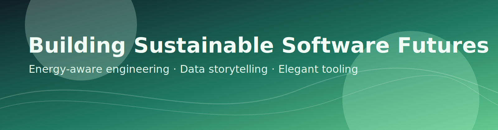

# Hi, I'm Chakib Belgaid 👋

I build software with one guiding idea: **high performance should also be energy-responsible**.

## 🌍 Current Plans

- Develop practical tooling to measure software energy usage at multiple levels (application, service, function, and code block).
- Publish reproducible benchmarks that help teams compare implementation choices through both performance and sustainability lenses.
- Keep building open resources that make **green coding** actionable for everyday engineering work.

## 🚀 Ambitions

- Turn energy-aware engineering into a standard quality metric, right beside latency, reliability, and cost.
- Bridge research and developer experience by shipping tools that are rigorous, visual, and easy to integrate in CI/CD.
- Build complete system architectures where energy efficiency, reliability, and developer productivity are designed together from day one.
- Contribute to a future where optimization means **better software + lower environmental impact**.

## 🎨 Taste & Working Style

- I like clean, minimal interfaces with meaningful visuals.
- I prefer evidence-driven decisions powered by metrics, KPIs, and clear data stories.
- I enjoy building systems that are elegant internally and useful externally.

## 🧪 Focus Areas

- Energy profiling & observability
- Performance diagnostics
- Data visualization for engineering insights
- Developer tooling for sustainable software
- Local LLM experimentation and on-device inference workflows
- Generative AI applications with measurable performance and energy trade-offs
- Agentic design patterns (tool use, memory, orchestration, and safety boundaries)
- End-to-end system architecture (data, model, infra, API, and product layers)

📎 Blog: [chakib-belgaid.github.io](https://chakib-belgaid.github.io)

---

## 🥜 My Activities in a Nutshell

---

## 🏆 Achievements

---

## Programming Languages

