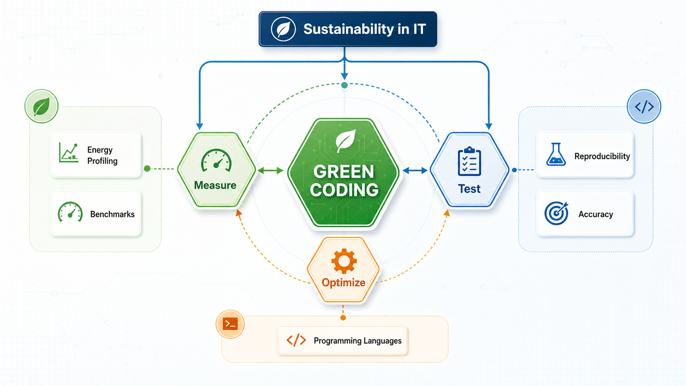

# Chakib

AI Research Engineer · Software Engineer · PhD in Software Engineering

I build to understand: research ideas, AI systems, software architecture, and the trade-offs that appear when something has to actually work.

I care about concrete systems over vague claims. I like research, but I respect engineering constraints: latency, reliability, cost, readability, evaluation, and the time it takes to turn an idea into something usable.

My default loop is simple: build, inspect, break, rebuild.

## PhD Thesis Map

This is one artifact from my thesis work. It says more about how I think than another sentence about "visual thinking".

Source: [thesisBrainMap.svg](assets/thesisBrainMap.svg) · [thesisBrainMap.drawio](assets/thesisBrainMap.drawio)

The map is about energy-aware software engineering: green coding, measurement, testing, optimization, benchmarks, programming languages, and the tooling needed to make the work reproducible.

## How I Think

- I learn fastest when I can see the system, test it, and improve it.
- I usually map the system before I try to simplify it.
- I like problems that feel like puzzles: unclear constraints, hidden failure cases, and multiple possible paths.
- Games, research, and startups shaped how I think about software: feedback loops, trade-offs, iteration, and taste.
- I appreciate open source because it makes serious learning and serious building more accessible.

## Current Focus

- AI systems that are useful beyond the demo
- Research ideas turned into working software
- Agentic workflows, inference, evaluation, and new AI application patterns
- Software architecture that stays understandable as systems grow
- Developer tools, automation, and experiments that help me learn faster
- Energy-aware and performance-aware engineering

## GitHub Metrics

### Activity

### Achievements

### Programming Languages

## Projects

### Current work

#### [Wattch](https://github.com/chakib-belgaid/Wattch)

Energy profiling infrastructure for developers and AI coding agents.

**Language:** Rust
**Status:** work in progress

### Most-starred public repos

- [jreferral](https://github.com/chakib-belgaid/jreferral) - recommends energy-efficient JVM configurations for Java software.
- [IJoules](https://github.com/chakib-belgaid/IJoules) - measures energy consumption of Python code on macOS / Intel CPU.
- [chakib_belgaid_thesis](https://github.com/chakib-belgaid/chakib_belgaid_thesis) - thesis source/materials behind my work on energy-aware software engineering.
- [django-analyses](https://github.com/chakib-belgaid/django-analyses) - analyzes energy consumption across Django projects with different optimization levels.
- [powerapi-g5k](https://github.com/chakib-belgaid/powerapi-g5k) - sample project for using PowerAPI inside Grid5000.

## Contact

- Blog: [chakib-belgaid.github.io](https://chakib-belgaid.github.io)
- LinkedIn: [linkedin.com/in/chakib-belgaid](https://linkedin.com/in/chakib-belgaid)
- Email : chakib.belgaid@gmail.com
