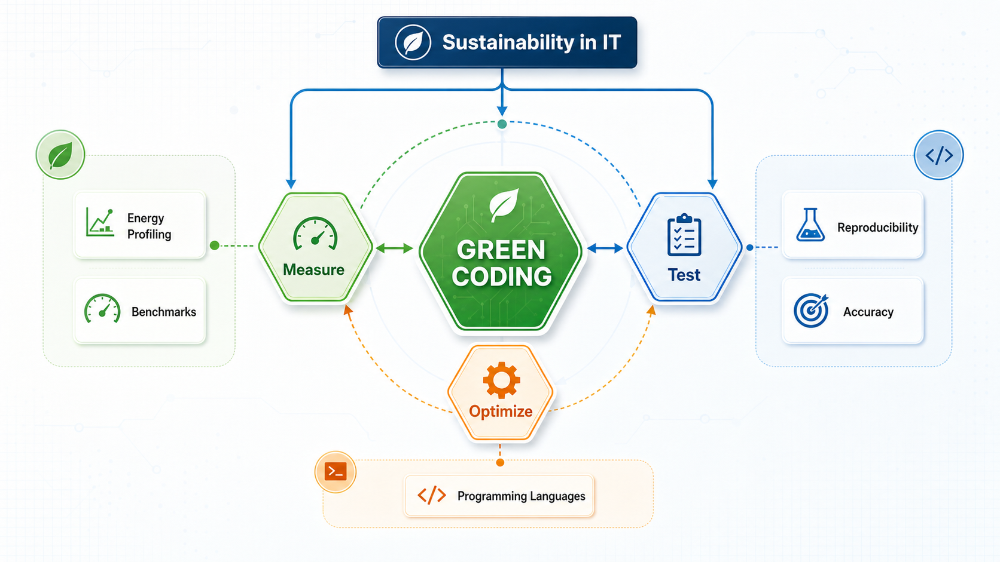

# Chakib Belgaid, PhD

I build AI systems, developer tools, creative media software, and energy-aware infrastructure.

The thread through my work is measurement and usable experimentation: LLM agents should be evaluated, production systems should be observable, creative tools should be tangible, and energy claims should be reproducible before they are optimized.

## Work

My current focus is the overlap between:

- LLM systems: tool-calling agents, retrieval, structured outputs, and evaluation loops.
- Backend systems: APIs, software architecture, automation, and production-facing developer tools.
- Creative tools: generative interfaces, audiobooks, and small web apps that are useful as tools, not only demos.
- Energy-aware software: measurement, benchmarking, profiling overhead, reproducibility, and regression detection.
- Research prototypes that become usable tools, not only demos.

## Current Projects

### Wattch

**[Wattch](https://github.com/chakib-belgaid/Wattch)** is an exploratory Rust energy-measurement stack for Linux.

The public v0.1-alpha implementation separates privileged RAPL acquisition from an unprivileged CLI through a Unix-domain socket. Messages use length-prefixed protobuf framing, and the CLI can list sources, stream samples, or report the RAPL energy observed while a child command runs. A deterministic in-memory backend exercises the same daemon/CLI protocol without root or hardware counters, making validation repeatable.

The current implementation deliberately stays conservative: it does **not** claim process-exclusive or function-level energy attribution. The focus is the measurement boundary, validation, reproducibility, and a clean foundation for additional hardware backends.

Linux release workflows build `.deb` and `.rpm` packages for the daemon and CLI.

### Whispbook

**[Whispbook](https://github.com/chakib-belgaid/whispbook)** is a self-hosted audiobook studio built with React and FastAPI.

It imports selectable-text documents into editable chapters and paragraphs, supports paragraph previews and background audiobook generation, and runs with local/open TTS engines including Kokoro, Chatterbox, and Chatterbox Turbo. Turbo workflows support character casts, highlighted voice ranges, custom styles, and inline paralinguistic cues such as `[laugh]` and `[breath]`.

Whispbook generates chapter `.m4a` audio, `.vtt` and `.srt` subtitles, and a final chaptered `.m4b` package with embedded subtitles. It can also export a Python generation script that snapshots the current book edits and TTS settings. The shipping studio remains separate from my experimental speaker-attribution and LoRA evaluation work.

## Recent Work

- **[Wattch](https://github.com/chakib-belgaid/Wattch)** - Rust RAPL daemon/CLI with protobuf-framed Unix sockets, deterministic validation, command-wrapper measurement, and Linux packaging.
- **[Whispbook](https://github.com/chakib-belgaid/whispbook)** - local-first audiobook production with editable documents, multi-engine TTS, character casts, progressive generation, subtitles, and M4B export.
- **[Fractal Brushes](https://github.com/chakib-belgaid/fractal-brushes)** - a generative-art web app for fractal and symmetry-based backgrounds. [Open the live demo](https://chakib-belgaid.github.io/fractal-brushes/).

## Selected Repositories

### Energy-aware software

- **[Wattch](https://github.com/chakib-belgaid/Wattch)** - current Rust prototype for reproducible, developer-facing RAPL energy measurement.
- **[jreferral](https://github.com/chakib-belgaid/jreferral)** - recommends energy-efficient JVM configurations for Java software.
- **[IJoules](https://github.com/chakib-belgaid/IJoules)** - measures energy consumption of Python code on macOS / Intel CPU.

### AI / developer tools

- **[whispbook](https://github.com/chakib-belgaid/whispbook)** - self-hosted React/FastAPI audiobook studio with local TTS, character voice workflows, subtitles, and M4B packaging.

### Creative web / media tools

- **[Fractal Brushes](https://github.com/chakib-belgaid/fractal-brushes)** - static frontend for generating artsy fractal and symmetry backgrounds. [Live demo](https://chakib-belgaid.github.io/fractal-brushes/).

## Research Foundation

My PhD work focused on energy-aware software engineering: measurement, benchmarking, testing, optimization, language/runtime behavior, and reproducibility. Wattch builds on that foundation by turning those research concerns into developer infrastructure with an explicit privilege boundary, deterministic validation, and conservative measurement semantics.

- **[chakib_belgaid_thesis](https://github.com/chakib-belgaid/chakib_belgaid_thesis)** - thesis source and materials.

Source: [thesisBrainMap.svg](assets/thesisBrainMap.svg) · [thesisBrainMap.drawio](assets/thesisBrainMap.drawio)

## Engineering Taste

- Measurable before optimized.
- Local-first when possible.
- Explicit about uncertainty and overhead.
- Useful to developers, not only impressive in demos.

## Contact

[Email](mailto:chakib.belgaid@gmail.com) · [LinkedIn](https://linkedin.com/in/chakib-belgaid) · [Blog](https://chakib-belgaid.github.io)
