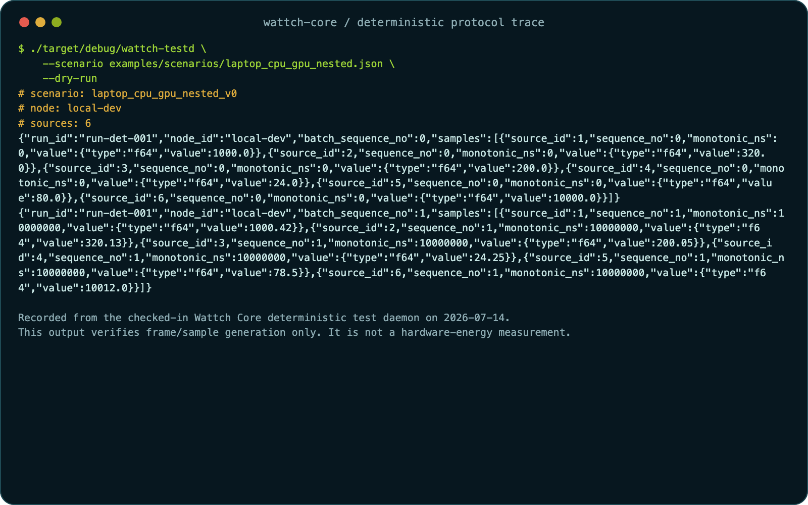
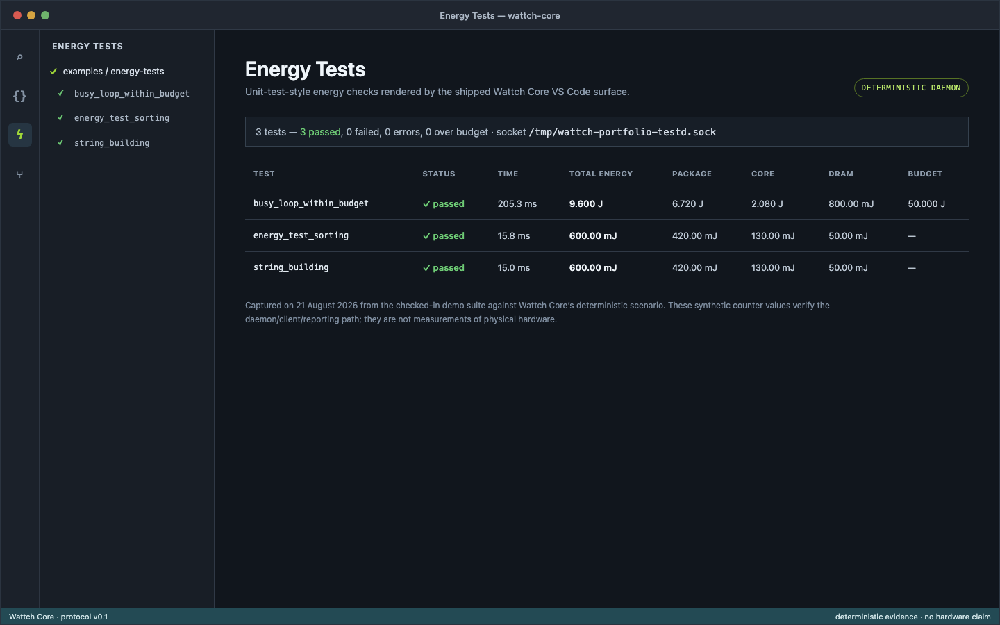

# Chakib Belgaid, PhD

I build AI systems, developer tools, creative media software, and energy-aware infrastructure.

My work connects product craft with measurable systems: local AI should remain useful without giving up privacy, developer tooling should preserve evidence, and energy claims should be reproducible before they are optimized.

[Portfolio](https://chakib-belgaid.github.io) · [LinkedIn](https://linkedin.com/in/chakib-belgaid) · [Email](mailto:chakib.belgaid@gmail.com)

## Featured work

### [Whisperbook](https://github.com/chakib-belgaid/whisper-book)

An offline-first Android app that turns local EPUB and PDF books into synchronized, multi-voice audiobooks. Import, chapter detection, speaker attribution, Supertonic 3 synthesis, Media3 playback, read-along state, voice casting, and MP3 export all stay on the device; the runtime deliberately has no network permission.

<table>
  <tr>
    <td align="center" width="33%">
       
      <strong>Now playing</strong> Progressive local narration with the active speaker in view.
    </td>
    <td align="center" width="33%">
       
      <strong>Read along</strong> Synchronized passages with manual speaker correction.
    </td>
    <td align="center" width="33%">
       
      <strong>Voice cast</strong> Previewable voices and language settings per book.
    </td>
  </tr>
</table>

These are API 36 captures of the production Compose UI using deterministic QA data. [Read the case study](https://chakib-belgaid.github.io/work/whispbook) · [Download the latest Android release](https://github.com/chakib-belgaid/whisper-book/releases/latest)

`Kotlin` · `Jetpack Compose` · `Room` · `WorkManager` · `Media3` · `Supertonic 3` · `sherpa-onnx`

### [Wattch Core](https://github.com/chakib-belgaid/wattch-core)

A protocol-first Rust measurement spine for Wattch. A privileged daemon acquires raw Linux RAPL or synthetic evidence, while unprivileged CLI, Python, and VS Code clients preserve source descriptors and samples in replayable artifacts. Interpretation stays outside the acquisition path.

<table>
  <tr>
    <td align="center" width="50%">
       
      <strong>Deterministic protocol trace</strong> Frame and sample generation through the checked-in scenario.
    </td>
    <td align="center" width="50%">
       
      <strong>Energy Tests</strong> Unit-test-style time, energy-domain, and budget results in VS Code.
    </td>
  </tr>
</table>

The captures above use deterministic/synthetic values to verify the daemon, client, and reporting workflow. They are not physical-hardware measurements or per-process energy claims. [Read the case study](https://chakib-belgaid.github.io/work/wattch)

`Rust` · `Linux RAPL` · `Unix sockets` · `Python` · `pyJoules API` · `VS Code` · `Replayable traces`

## Other selected work

- **[Fractal Brushes](https://github.com/chakib-belgaid/fractal-brushes)** — generative fractal and symmetry backgrounds. [Live demo](https://chakib-belgaid.github.io/fractal-brushes/)
- **[jreferral](https://github.com/chakib-belgaid/jreferral)** — recommends energy-efficient JVM configurations for Java software.
- **[IJoules](https://github.com/chakib-belgaid/IJoules)** — measures energy consumption of Python code on macOS / Intel CPU.

## Research foundation

My PhD work focused on energy-aware software engineering: measurement, benchmarking, testing, optimization, language/runtime behavior, and reproducibility. Wattch Core carries that foundation into developer infrastructure with an explicit acquisition boundary, typed evidence, deterministic validation, and replayable traces.

- **[chakib_belgaid_thesis](https://github.com/chakib-belgaid/chakib_belgaid_thesis)** — thesis source and materials.

Source: [thesisBrainMap.svg](assets/thesisBrainMap.svg) · [thesisBrainMap.drawio](assets/thesisBrainMap.drawio)

## Engineering taste

- Measurable before optimized.
- Local-first when possible.
- Explicit about uncertainty and overhead.
- Useful to developers, not only impressive in demos.
